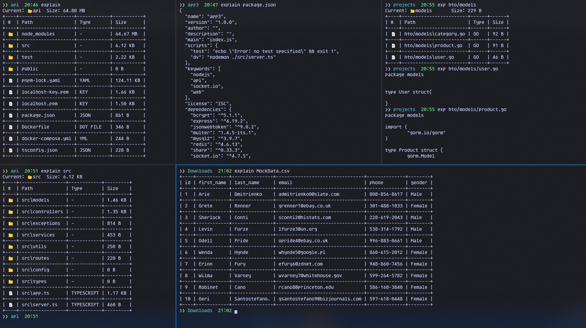

# Exp or Explain

**Exp** short form of **Explain** is a command-line tool that provides detailed information about the contents of a directory or a file. It can be used as an alternative to common Unix commands like `ls` and `cat`, offering additional features such as displaying the top 10 rows of a CSV file and calculating the total sizes of directories and files. 

The tool also presents the data in a well-formatted table for easy readability, using pretty printing techniques.
## Screenshot



## Features

1. **Directory Size Information**: 
   - Shows the total size of a directory and its subdirectories (recursively) along with individual file sizes.
   - Displays folder and file information in a table with size and type details.

2. **File Content Display**:
   - If a file is specified, the tool will print the contents of the file to the terminal, similar to the `cat` command.
   - If the file is a CSV, it will display the first 10 rows in a well-formatted table.

3. **File Type Detection**:
   - Detects the type of file based on its extension and displays it in the output table.

4. **Progress Bar**:
   - A progress bar is displayed while calculating the size of large directories to track the process.
## Installation

#### Windows: 
```pwsh
choco install explain
```

or run below command in git bash or any bash terminal
```sh
git clone https://github.com/xtareq/explain
mkdir /c/tools/explain
mv explain/build/ /c/tools/explain
setx PATH "%PATH%;C:\tools\explain"
```

 Verify Installation: Close the current CMD window and open a new one. Verify that your CLI tool works by typing its name:

```bash
explain
```
If everything is set up correctly, the command should now work globally from any directory.
#### Linux: 
Coming Soon
#### Mac: 
Coming Soon

## Manual Build

You need to have [Rust](https://www.rust-lang.org/tools/install) installed to build and run this tool.

1. Clone the repository:
   ```bash
   git clone https://github.com/xtareq/explain
   cd explain
   ```

2. Build the project:
   ```bash
   cargo build --release
   ```

3. Optionally, install the tool globally:
   ```bash
   cargo install --path .
   ```

## Usage

To use the tool, run the following command:

```bash
explain [path]
```

### Examples:

1. **View contents of the current directory:**
   ```bash
   explain
   ```

   This will display the contents of the current directory, showing folders, files, and their sizes.

2. **View directory information for a specific path:**
   ```bash
   explain /path/to/directory
   ```

   This will list all subdirectories and files in the given path, along with their sizes.

3. **View file content:**
   ```bash
   explain /path/to/file.txt
   ```

   This will print the content of the file to the terminal, similar to the `cat` command.

4. **View top 10 rows of a CSV file:**
   ```bash
   explain /path/to/file.csv
   ```

   This will display the first 10 rows of the CSV file in a tabular format.

### Short Alias

You can also use the short alias `exp` to execute the same commands.

```bash
exp [path]
```

## How It Works

- **Directory Size Calculation**: The program recursively calculates the size of each directory and its subdirectories using `fs::read_dir` and `metadata()` to gather file and directory information. It skips any files or directories that cannot be accessed due to permission errors.
  
- **File Type Detection**: The program detects file types based on their extensions. It includes a predefined list of common file extensions like `.rs` for Rust, `.py` for Python, `.jpg` for JPEG images, etc.
  
- **CSV Display**: If a CSV file is detected, it reads the top 10 rows and displays them in a nicely formatted table using the `prettytable` crate.

- **Progress Bar**: The progress bar is shown while the directory size is being calculated. It updates as the program scans each entry in the directory.

## Crates Used

The following external libraries (crates) are used in this project:

1. [`csv`](https://docs.rs/csv/latest/csv/) - For reading CSV files.
2. [`prettytable`](https://docs.rs/prettytable-rs/latest/prettytable/) - For displaying data in a well-formatted table.
3. [`indicatif`](https://docs.rs/indicatif/latest/indicatif/) - For displaying progress bars.
4. [`std::env`](https://doc.rust-lang.org/std/env/) - For handling command-line arguments.
5. [`std::fs`](https://doc.rust-lang.org/std/fs/) - For file system operations like reading directories and file metadata.

## Contributing

Feel free to submit pull requests for improvements or bug fixes. Please make sure to run the tests and follow standard Rust coding practices.

## License

This project is licensed under the MIT License.
